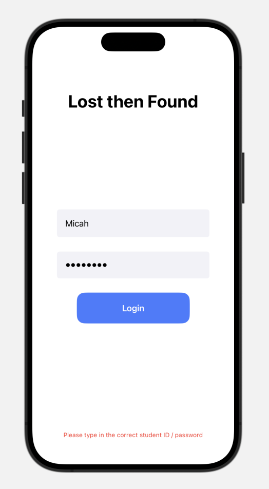

<h1 align="center">Lost Then Found App for HKIS-SDLTH-HACKATHON-2024</h1>

<p align="center">
  
</p>

<p align="center">
  <strong>Lost & Found App</strong> is a user-friendly IOS application developed for the HKIS SDLT 2024 Hackathon. It allows users to easily post lost items with information about where they were found and where they should be retrieved.
</p>

<p align="center">
  <a href="#key-features">Key Features</a> •
  <a href="#screenshots">Screenshots</a> •
  <a href="#installation">Installation</a> •
</p>

## Key Features

- **User Authentication:** Secure login and registration system for users.
- **Lost Item Posting:** Users can easily post details about lost items, including where they were found and where they should be retrieved.

## Screenshots

<p align="center">
  
</p>

## Installation

1. Clone the repository:

   ```bash
   git clone [https://github.com/your-username/lost-and-found-app.git](https://github.com/cheesebuilding/HKIS-SDLT-HACKATHON-2024.git)https://github.com/cheesebuilding/HKIS-SDLT-HACKATHON-2024.git
